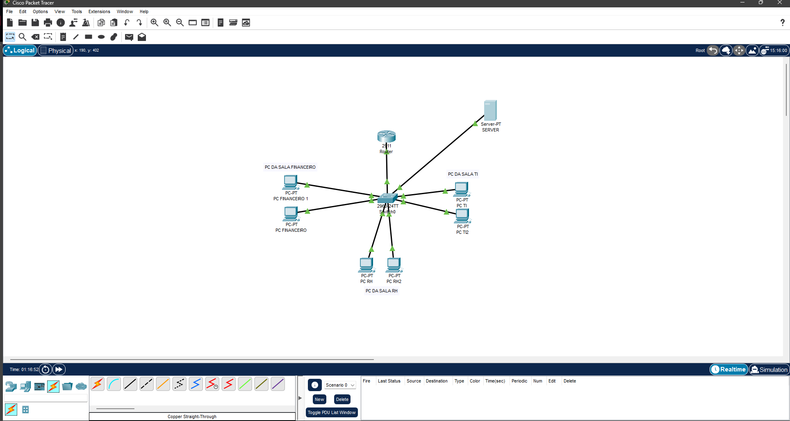
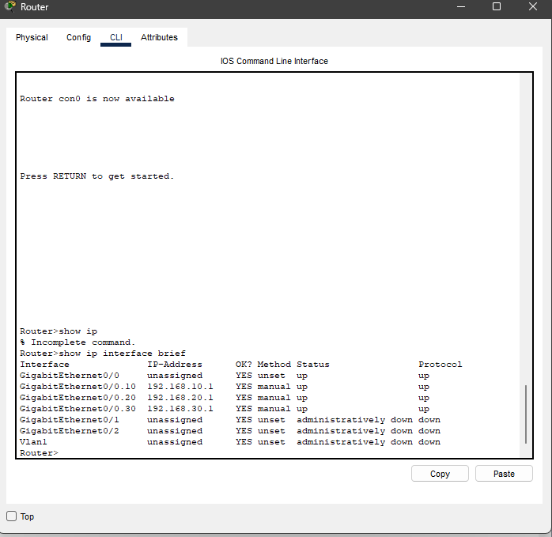
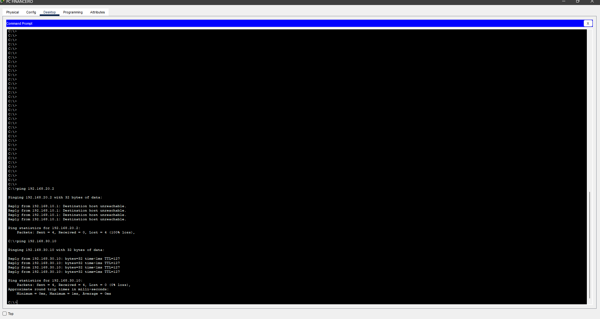
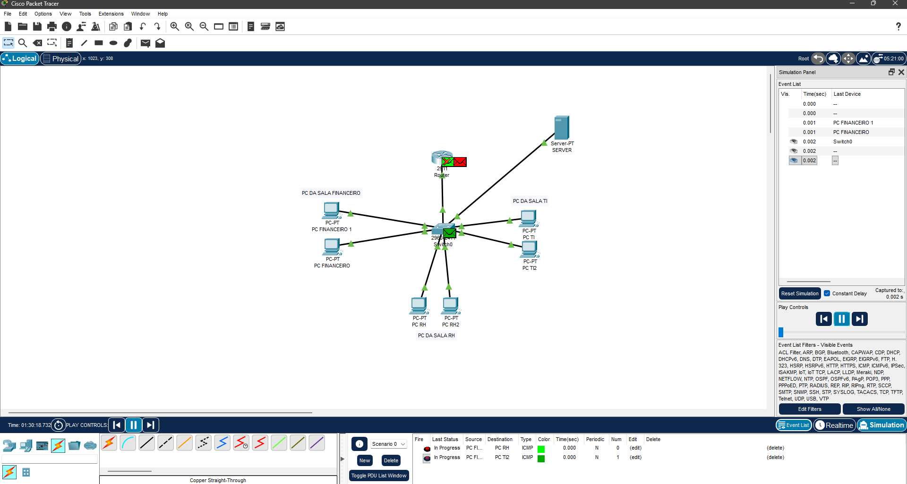

# 🖧 Rede Corporativa com VLANs (Cisco Packet Tracer)

## 📌 Visão Geral

Este projeto simula uma rede corporativa segmentada utilizando VLANs, com comunicação entre redes através de roteamento inter-VLAN.

## 🧠 Tecnologias Utilizadas

* Cisco Packet Tracer
* VLAN (802.1Q)
* Router-on-a-Stick
* Endereçamento IPv4

## 🏗️ Topologia

## ⚙️ Configuração

### VLANs:

* VLAN 10 → Administrativo
* VLAN 20 → Financeiro
* VLAN 30 → TI

### Roteamento:

* Subinterfaces no roteador
* Encapsulation dot1Q

## 🔌 Testes Realizados

* Comunicação entre VLANs (ping) ✅
* Isolamento de rede funcionando ✅
* Trunk configurado corretamente ✅

## 📁 Arquivos

* laboratorio_vlan_segurança.pkt

## 🚀 Resultado

Rede segmentada funcional, com separação de setores e comunicação controlada entre VLANs.

## 👨‍💻 Autor

Vinicius Guilherme
